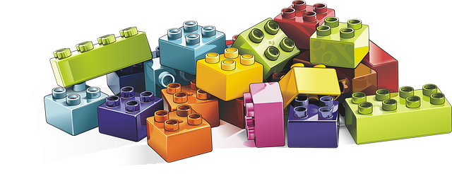
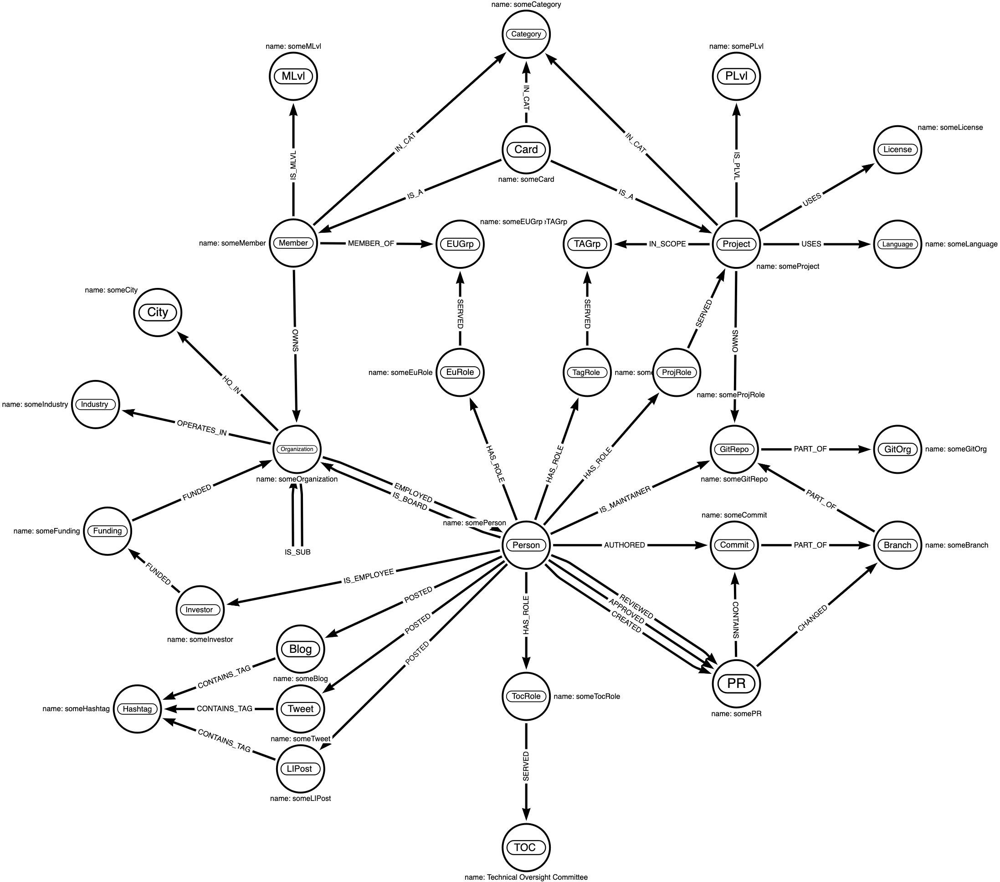
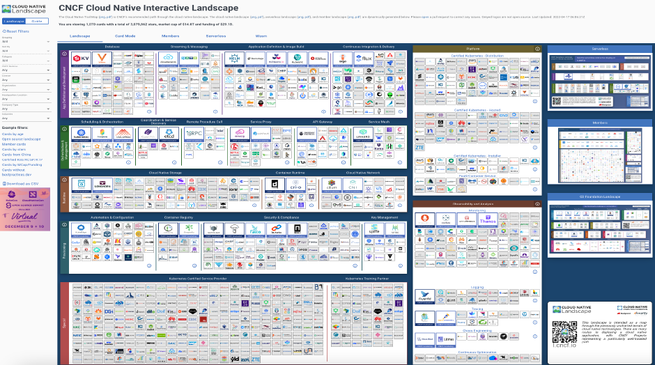
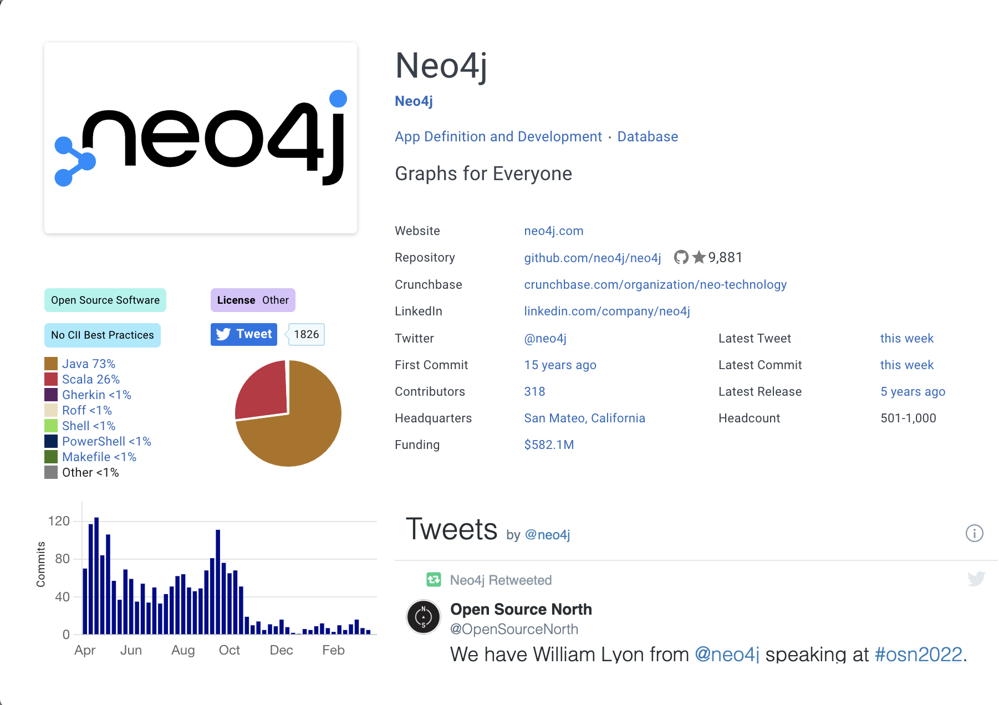
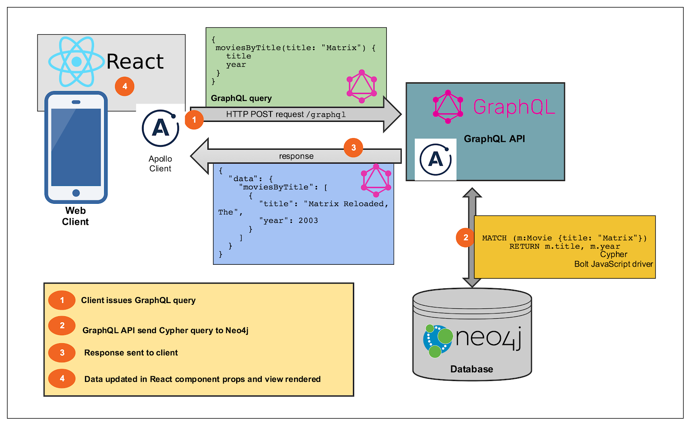
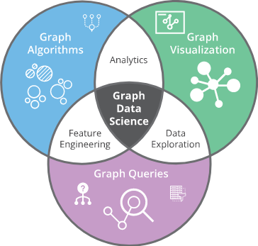

# CNCF Landscape Graph

:warning: Initial, open, active development. :warning:  

Join us @ [#landscape-graph][lg-slack]. Here's our [current activities][lg-plan]. Formal plan and [roadmap](https://github.com/cncf/landscape-graph/issues/46) are in progress.

[lg-slack]: https://cloud-native.slack.com/archives/C03BXBYFMQS
[lg-plan]: https://github.com/orgs/cncf/projects/7

---

Often, we need to understand how an open source project interacts with others, how it's changing over time, and who's enabling it's continued success. We want to understand what alternatives exist, or how complementary projects might be combined in purpose-fit or novel ways. We might want to dive in and contribute! This is how projects and ecosystems grow to meet business challenges facing modern organizations.

## Landscape Graph Data Model

Graphs can facilitate rich analysis of our vibrant and dynamic communities, the humans they comprise, and the clusters of contribution and thought leadership they produce.

Using the [data][seeddata] underlying the existing landscape as input, a Labeled Property Graph ([LPG][lpg]) is constructed using [Cypher][ocypher] (SQL for Graphs), resulting in a [Neo4j][neo] graph database.

[seeddata]: https://landscape.cncf.io/data/items.json
[lpg]: https://neo4j.com/blog/rdf-triple-store-vs-labeled-property-graph-difference
[ocypher]: https://opencypher.org
[neo]: https://neo4j.com
[cypherdev]: https://neo4j.com/developer/cypher/

Here's the schema:

<!-- TODO: add graphic for transition-->

<!-- TODO: add definitions for KG, Ontology, taxonomy, somewhere-->

---

## "Origin Story"

In November of 2018 there were 25 CNCF projects.

At the time [Ayrat Khayretdinov][archyufa] published the "[Beginner's Guide to the CNCF Landscape][guide]." It opened with:

[archyufa]: https://twitter.com/archyufa
[guide]: https://www.cncf.io/blog/2018/11/05/beginners-guide-cncf-landscape

> The cloud native landscape can be complicated and confusing. Its myriad of **open source projects are supported by the constant contributions of a vibrant and expansive community.** The Cloud Native Computing Foundation (CNCF) has a landscape map that shows the full extent of cloud native solutions, many of which are under their umbrella.

It described the CNCF Mission in these terms:

> The CNCF fosters this landscape of open source projects by **helping provide end-user communities with viable options for building cloud native applications.** By encouraging projects to collaborate with each other, the CNCF hopes to enable fully-fledged technology stacks comprised solely of CNCF member projects. **This is one way that organizations can own their destinies in the cloud.**

## We.  Have.  Grown.

<!-- TODO: source the report -->
Today there are 5.4 million humans using Kubernetes and the landscape continues to expand.

| 2022 Q2   | Cards | :star:    | cap      | funding |
| --------- | ----- | --------- | -------- | ------- |
| projects  | 111   | 614,394   | $291.4 M | $29.6 M |
| ecosystem | 1,061 | 3,066,372 | $15.7 T  | $29.1 B |

## We have a "good" problem

The [CNCF Landscape][landscape] aggregates summary data from GitHub, Crunchbase, Yahoo Finance, Twitter, and other sources while providing the ability quickly find, filter, and group the more than 1000 Cards across numerous dimensions.  It is automagically updated daily. It continues to work as designed.

[landscape]: https://landscape.cncf.io

With a single well placed click a wealth of data can be summoned. Here's the "Card" for [Neo4j](https://neo4j.com)

This is perfect when we know what we're looking for (specifically).

## Technical TLDR

### GRANDstack (<https://grandstack.io>)

_source: [grandstack.io/docs/...](https://grandstack.io/docs/getting-started-neo4j-graphql)_

GRANDstack is a combination of technologies that work together to enable developers to build data intensive full stack applications. The components of GRANDstack are:

* **G**raphQL -  A new paradigm for building APIs, GraphQL is a way of describing data and enabling clients to query it.
* **R**eact   -  A JavaScript library for building component based reusable user interfaces.
* **A**pollo  -  A suite of tools that work together to create great GraphQL workflows.
* **N**eo4j **D**atabase - The native graph database that allows you to model, store, and query your data the same way you think about it: as a graph.

Here's how it all fits together in the context of a movie search app:

### Additional tools and frameworks

_TODO: [#27](https://github.com/cncf/landscape-graph/issues/27)_

| **Component**         | **What it is**
| ---                   | ---
| Neo4j GraphQL Library | [{neo}/product/graphql-library](<https://neo4j.com/product/graphql-library>), ([dev blog](https://neo4j.com/developer-blog/announcing-the-release-of-the-neo4j-graphql-library-3-0-0/))
| Neo4j Streams         | [{neo}/labs/kafka](<https://neo4j.com/labs/kafka>), [{gh}/neo4j-contrib/neo4j-streams](https://github.com/neo4j-contrib/neo4j-streams)
| gitbase               | Git history as MySQL, [src-d/gitbase](https://github.com/src-d/gitbase)
| JavaFX                | UI, 3d, [openjfx.io](https://openjfx.io)
| Quarkus               | AoT, minify, Dev UX, [quarkus.io](https://quarkus.io)

## Graph Data Science Algorithms ("Why Neo4j?")

<https://neo4j.com/developer/graph-data-science/graph-algorithms>

Graph Databases “perform the join on insert” instead of query time. No joins or table scans required.

A graph data model (vs. rectangular relational) can bring to bear all
that we’ve learned from ad/fin/security tech, big data, ml, etc.

## Graph Data Science Algorithm Types

Docs --> <https://neo4j.com/docs/graph-data-science/current>

| Type                              | Definition |
| --------                          | --------   |
| [Path Finding][PathF]             | Help find the shortest path or evaluate the availability and quality of routes |
| [Centrality][Central]             | Determine the importance of distinct nodes in a network |
| [Community Detection][CommD]      | Evaluate how a group is clustered or partitioned, as well as its tendency to strengthen or break apart |
| [Similarity][Similar]             | Help calculate the similarity of nodes |
| [Topological link prediction][TP] | Determine the closeness of pairs of nodes |
| [Node Embeddings][Embed]          | Compute vector representations of nodes in a graph. |
| [Node Classification][NC]         | Uses machine learning to predict the classification of nodes. |
| [Link prediction][LP]             | Use machine learning to predict new links between pairs of nodes. |

[PathF]:   https://neo4j.com/docs/graph-data-science/current/algorithms/pathfinding
[Central]: https://neo4j.com/docs/graph-data-science/current/algorithms/centrality
[CommD]:   https://neo4j.com/docs/graph-data-science/current/algorithms/community
[Similar]: https://neo4j.com/docs/graph-data-science/current/algorithms/similarity
[TP]:      https://neo4j.com/docs/graph-data-science/current/algorithms/linkprediction
[Embed]:   https://neo4j.com/docs/graph-data-science/current/algorithms/node-embeddings
[NC]:      https://neo4j.com/docs/graph-data-science/current/algorithms/ml-models/node-classification
[LP]:      https://neo4j.com/docs/graph-data-science/current/algorithms/ml-models/linkprediction

### Cypher ("SQL for Graphs")

<https://github.com/opencypher/openCypher>

> Cypher is a declarative graph query language that allows for expressive and efficient querying, updating and administering of the graph. It is designed to be suitable for both developers and operations professionals. Cypher is designed to be simple, yet powerful; highly complicated database queries can be easily expressed, enabling you to focus on your domain, instead of getting lost in database access.

On its influences and roots:

> Cypher is inspired by a number of different approaches and builds on established practices for expressive querying. Many of the keywords, such as WHERE and ORDER BY, are inspired by SQL. Pattern matching borrows expression approaches from SPARQL. Some of the list semantics are borrowed from languages such as Haskell and Python. Cypher’s constructs, based on English prose and neat iconography, make queries easy, both to write and to read.

## How to Contribute

* Join us @ [#landscape-graph][lg-slack].
* Review our current [plan][lg-plan].
* Help us to [make this better][lg-cguide] :)

[lg-slack]: https://cloud-native.slack.com/archives/C03BXBYFMQS
[lg-plan]: https://github.com/orgs/cncf/projects/7
[lg-cguide]: https://github.com/orgs/cncf/projects/7/views/6

## License

This repository contains data received from Crunchbase. This data is not licensed pursuant to the Apache License. It is subject to Crunchbase’s Data Access Terms, available at <https://data.crunchbase.com/docs/terms>, and is only permitted to be used with Linux Foundation landscape projects.

Everything else is under the Apache License, Version 2.0, except for project and product logos, which are generally copyrighted by the company that created them, and are simply cached here for reliability.
