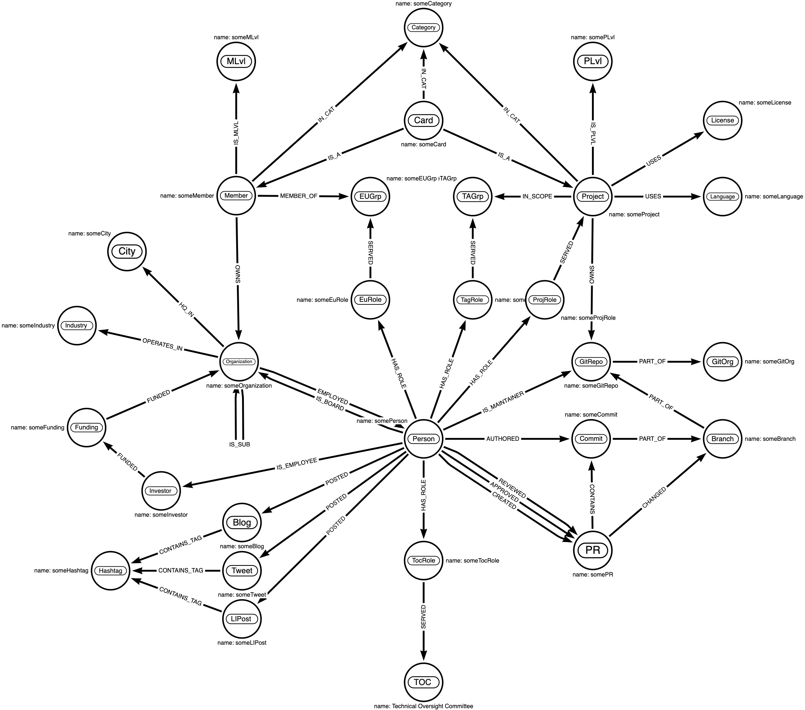

# Graph Data Model

## How this works


(source: https://neo4j.com/developer/graphql/#_the_neo4j_graphql_library)

## Core Data Model




### Entities

**TODO: ctx->allTheThings.ToMarkdown();**

## Sub-Graph Modules (SGM)

### SGM Goals

* facilitate interactive, dynamic expansion of the graph using [core](core) as nucleus and/or seed.
* enable collaboration in parallel while ensuring viability of standalone tests.
* work with a broad, arbitrary set of targets, environments, toolchains, and compositional frameworks
* provide an extensible mechanism for new Entities, and new types of Entites to be added to landscape-graph
* able to be easily distributed on existing transports.  
  * OCI is a great fit. https://github.com/cnabio/cnab-to-oci 


### Types of Sub-Graph Modules (SGM)

All "base" types derive from a singular shared root, base type.

Each of these is an Interface, acting as a base class with shared properties.

| base types           | derived types |
| ---                  | --- |
| [blogs](blogs)       | CNCF, thenewstack, medium.*, LinkedIn Posts, ... |
| [boards](boards)     | GH Discuss, StackOverflow |
| [cncf](cncf)         | Member, Project, License, TAG, EUG, TOC, Organizations, ...
| [core](core)         | Core Data Model |
| [corp](corp)         | crunchbase, yahoofinance |
| [email](email)       | cncf project lists, k8s lists |
| [packages](packages) | brew, choco, crate, deb, deno, go, maven, npm, pip, rpm |
| [rtc](rtc)           | slack, discord, gitter |
| [social](social)     | twitter, linkedin |
| [threats](threats)   | nist |
| [videos](videos)     | youtube |

Each module will have the following:

* base metadata (name, version, ...)
* GraphQL Schema, deriving from the base type.
* png, svg, .json (arrows.app :))
* Description / Documentation covering entities
* sample data, patterns, and queries
* CI

```shell
.
├── blogs
│   └── sgm-blogcncf
├── boards
│   ├── sgm-ghdiscuss
│   └── sgm-stackoverflow
├── core
│   └── generated
├── corp
│   ├── sgm-crunchbase
│   └── sgm-yahoofinance
├── email
├── packages
│   ├── sgm-brew
│   ├── sgm-choco
│   ├── sgm-crate
│   ├── sgm-deb
│   ├── sgm-deno
│   ├── sgm-go
│   ├── sgm-maven
│   ├── sgm-npm
│   ├── sgm-pip
│   └── sgm-rpm
├── rtc
│   ├── sgm-discord
│   └── sgm-slack
├── social
│   ├── sgm-linkedin
│   └── sgm-twitter
├── threats
│   └── sgm-nist
└── videos
    └── sgm-youtube
```

## How GraphQL Interfaces Work

https://neo4j.com/docs/graphql-manual/current/type-definitions/interfaces/#_directive_inheritance

> Any directives present on an interface or its fields will be "inherited" by any object types implementing it. For example, the type definitions above could be refactored to have the @relationship directive on the actors field in the Production interface instead of on each implementing type as it is currently:

```graphql
interface Production {
    title: String!
    actors: [Actor!]! @relationship(type: "ACTED_IN", direction: IN, properties: "ActedIn")
}

type Movie implements Production {
    title: String!
    actors: [Actor!]!
    runtime: Int!
}

type Series implements Production {
    title: String!
    actors: [Actor!]!
    episodes: Int!
}

interface ActedIn @relationshipProperties {
    role: String!
}

type Actor {
    name: String!
    actedIn: [Production!]! @relationship(type: "ACTED_IN", direction: OUT, properties: "ActedIn")
}
```

<https://neo4j.com/docs/graphql-manual/current/type-definitions/interfaces/#_overriding>

> In addition to inheritance, directives can be overridden on a per-implementation basis. Say you had an interface defining some Content, with some basic authorization rules:

```graphql
interface Content
    @auth(rules: [{ operations: [CREATE, UPDATE, DELETE], allow: { author: { username: "$jwt.sub" } } }]) {
    title: String!
    author: [Author!]! @relationship(type: "HAS_CONTENT", direction: IN)
}

type User {
    username: String!
    content: [Content!]! @relationship(type: "HAS_CONTENT", direction: OUT)
}

type PublicContent implements Content {
    title: String!
    author: [Author!]!
}

type PrivateContent implements Content
    @auth(rules: [{ operations: [CREATE, READ, UPDATE, DELETE], allow: { author: { username: "$jwt.sub" } } }]) {
    title: String!
    author: [Author!]!
}
```
