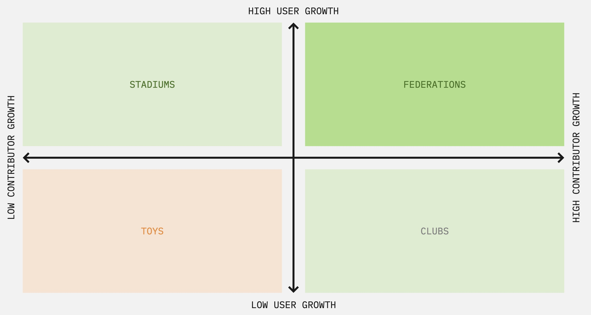

# On Classifying Projects and Communities

<!-- TOC tocDepth:2..3 chapterDepth:2..6 -->

- [Types of Projects, Contributors, and Communities](#types-of-projects-contributors-and-communities)
    - [Project Types](#project-types)
    - [Project member types](#project-member-types)
    - [Contributor Cohorts (Segmentation)](#contributor-cohorts-segmentation)
    - [Project Metrics, Measures, and Attributes](#project-metrics-measures-and-attributes)

<!-- /TOC -->

_apart from the diagram, what's below is reproduced from "Working in Public," by Nadia Eghbal ([https://press.stripe.com/working-in-public](https://press.stripe.com/working-in-public))_

## Types of Projects, Contributors, and Communities

### Project Types

The upper right quadrant (Federations) have the **highest user and contributor growth**, while the lower left quadrant (Toys) have the lowest of both measures.

#### Federations

- rare, impactful, ubiquitous
- ~ < 3% of OSS projects
- outsized impact and adoption
- growth pattern: shard
- complex governance, large scale

#### Stadiums

- very low maintainer to user ratio.
- Unlike Federations and Clubs, which exhibit *decentralized communities*, Stadiums typically have a *centralized community topology*.

- Often enjoy large, sometimes federated user communities and groups, oftentimes replicated and segmented by geography. .

#### Clubs

- often contributors are users.
- Niche Languages, Frameworks, Libraries
- domain specific solutions
- analogous to meetups or hobby groups self-selected users, often aligned around a singular axis/dimension of common needs or interests.
- Passionate, dedicated, cadre of contributors. High Net Promoter Score (NPS).

#### Toys

- Side Projects, Hackathon outcomes, experiments, personal growth/learning projects.

### Project member types

#### Maintainers

Maintainers are those who are responsible for the future of a project's repository (or repositories), whose decisions affect the project laterally. Maintainers can be thought of as "trustees" or stewards of the project.

#### Contributors

Contributors are those who make contributions to a project's repository, ranging from casual to significant, but who aren't responsible for its overall success.

##### Active Contributors

(aka "regular" or "long-term" contributors) are considered members of the project, based on their reputation, the consistency of their contributions, or in many cases by explicit declaration from the project's governance mechanism(s) or via fiat.

##### Casual Contributors

Also known as drive-by, reactive, or passive contributors. Often motivated by interests of self or employer, commonly presenting with a transactional engagement style.

#### Users

Users are those whose primary relationship to a project's repository is to consume or use its code [and/or artifacts].

##### Active Users

Frequently self-identified in ADOPTERS.md or via other declarative mechanisms, and captured in case studies and whitepapers as part of project collateral. Historically (and more generally) a project's maintainers don't have a way to identify users, an expectation shared by Users.

##### Passive Users

#### On project member type mobility and fluidity

TODO: Contributor Ladder, and its utility as a signal type.

TODO: Reference and/or link to tag-contributor-strategy docs

### Contributor Cohorts (Segmentation)

#### What's "Cohort Analysis?"

> **Cohort analysis** is a kind of [behavioral analytics](https://en.wikipedia.org/wiki/Behavioral_analytics) that breaks the data in a [data set](https://en.wikipedia.org/wiki/Data_set) into related groups before analysis. These groups, or [cohorts](https://en.wikipedia.org/wiki/Cohort_(statistics)), usually share common characteristics or experiences within a defined time-span.^[1]^^[2]^ Cohort analysis allows a company to "see patterns clearly across the life-cycle of a customer (or user), rather than slicing across all customers blindly without accounting for the natural cycle that a customer undergoes."^[3]^ By seeing these patterns of time, a company can adapt and tailor its service to those specific cohorts. While cohort analysis is sometimes associated with a [cohort study](https://en.wikipedia.org/wiki/Cohort_study), they are different and should not be viewed as one and the same. Cohort analysis is specifically the analysis of cohorts in regards to [big data](https://en.wikipedia.org/wiki/Big_data) and [business analytics](https://en.wikipedia.org/wiki/Business_analytics), while in cohort study, data is broken down into similar groups.

_(source: [https://en.wikipedia.org/wiki/Cohort_analysis](https://en.wikipedia.org/wiki/Cohort_analysis))_

#### n-th Time Contributors

- First Time Contributors
- Second Time Contributors
- Third Time Contributors

#### Reputation Index

This is problematic if not done transparently. We might consider generating a number of indices and considering their utility in practice.

### Project Metrics, Measures, and Attributes

These form part of a picture, but taken alone, in isolation, or without local, project specific context they are in practice often misunderstood.  

For all given points in time, aggregated by cohort(s) or other dimensions (never by individual):

- OSS Scorecard Metrics
- Active vs Passive Contributors
- Active vs Passive Users
- Number of open Issues
- Number of open Pull Requests (PR)
- Average time to close an Issue
- Average time to close a PR
- Average time to First Response to Issue
- Average time to First Response to PR
- Granularity of code/issue/pr churn (index over time)
- Patterns of Project Activity over time
- Bus Factor (low number of contributors working on the same areas of code/project over time).
- Popularity (Stars, @mentions, #hashtags)
- Depended Upon (aka PageRank) by other OSS projects
- Depended Upon by Apple Services as correlated via SBOM data.
