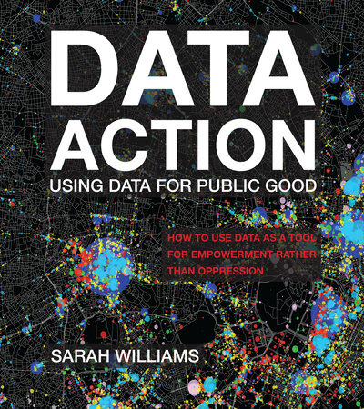

<!-- TOC tocDepth:2..3 chapterDepth:2..6 -->

- [Values: How we use data](#values-how-we-use-data)
    - [Sharing Data Creates Transparency, Public Participation, and Collaboration](#sharing-data-creates-transparency-public-participation-and-collaboration)
    - [It's how we work with data that really matters](#its-how-we-work-with-data-that-really-matters)
- [How to responsibly use data](#how-to-responsibly-use-data)
    - [Axioms](#axioms)

<!-- /TOC -->

# On Contributor Privacy

Open Source Projects are created, managed, and sustained by communities of contributors, maintainers, users, & vendors. As we seek to better understand the size, composition, topology, and shape of open source communities, we must exercise care and caution. The evolution and prevalence of open source software has made it increasingly easy to inadvertently, accidentally and unknowingly violate the privacy of contributors, causing harm and potentially putting people at risk, and in some cases danger.

We have guidelines and rubrics for understanding how to build secure systems and defined controls to ensure that once built, our systems remain secure. Analogous guidelines and controls for privacy for the project are informed by some of the following ideas, which are presented in 

[Data Action: Using data for public good](https://direct.mit.edu/books/book/4983/Data-ActionUsing-Data-for-Public-Good)_"How to use data as a tool for empowerment rather than oppression"_.

_<https://direct.mit.edu/books/book/4983/Data-ActionUsing-Data-for-Public-Good>_

#### Additional Resources

* Sophia Vargas's talk, "**Design Metric Programs to Respect Contributor Expectations and Promote Safety**" ([video](https://www.youtube.com/watch?v=b3KuTUc_mw0), [sched](https://sched.co/1R2qL)), and found it to be insightful.

## Values: How we use data

*Excerpts and quotes taken from “Data Action: Using Data For Public Good” unless otherwise noted.*

<https://mitpress.mit.edu/9780262545310/data-action>

### Sharing Data Creates Transparency, Public Participation, and Collaboration

"Sharing Data does so much more than provide access to information. It **creates trusting relationships, changes power dynamics, teaches us about policies, fosters debate, and helps to generate collaborative knowledge sharing,** all of which are essential to building strong, deliberative communities." *S. Williams, Data Action: Using data for public good, p. 137*

"Data visualizations help create a narrative around an idea, and **it's the narrative that ultimately has the ability to change people's hearts and minds**. When using data for action, **we must focus on the story we want to tell** with the data." *S. Williams, Data Action: Using data for public good, p. 141*

### It's how we work with data that really matters

…big data in its raw form cannot perform on its own; rather how data is transformed and operationalized can change the way we see the world. More specifically, **data can be used for civic action and policy change by communicating with the data clearly and responsibly to expose the hidden patterns and ideologies** to audiences inside and outside the policy arena. Communicating with data in this way requires the ability to **ask the right questions, **find or **collect the appropriate data, analyze and interpret that data, and visualize the results in a way that can be understood by broad audiences.**

**Combining these methods transforms data** from a simple point on a map **to a narrative that has meaning.** Data is not often processed in this way because data analysts are often not familiar with the techniques that can be used to tell stories with the data ethically and responsibly.

## How to responsibly use data

1. We must interrogate the reasons we want to use data and determine the potential for our work to do more harm than good.

2. Building teams to create narratives around data for action is essential for communicating the results effectively, but team collaboration also helps to make sure no harm is done to the people represented in the data itself.

3. Building data helps change the power dynamics inherent in controlling and using data, while also having numerous side benefits, such as teaching data literacy.

4. Coming up with unique ways to acquire, quantify, and model data can expose messages previously hidden from the public eye; however, we must expose ideas ethically, going back to the first principle above.

5. We must validate the work we do with data by literally observing the phenomenon on the ground and asking those it [affects] to interpret the results.

6. Sharing data is essential for communicating the need for policy change and generating a debate essential for that work. Data visualizations are effective at doing that.

7. We must remember that data are people, and we must do them no harm. Regulations help provide standards of practice for the use of data, but they often are not developed in line with technological change; therefore, we must seek to develop our own standards and call upon others to do the same.

### Axioms

#### The Purpose for Using Data Analytics Must Be Interrogated

…analysts must begin by asking policy questions of people with on-the-ground expertise, those who know the issue the best - and by believing ultimately that this collaboration will create smarter models. *p.215*

#### Building Expert Teams is Essential to Making Data Work for Policy Change

…working collaboratively with policy experts, communities, and designers is essential to reduce the potential for analytics to guide us toward misleading, unethical, or inaccurate conclusions. But more importantly, building expert teams helps *communicate* the work.

#### Building Data Changes Power Dynamics and Shapes Communities

…building data has other benefits: it teaches data literacy, builds communities around shared ideas, and creates media buzz around topics by placing them on the policy agenda.

#### Quantify Ingeniously, but Remember Data Is Biased by Its Creator

#### Data Brings Insights to the Public in Dynamic Ways

#### Data Are People, and We Must Do Them No Harm

