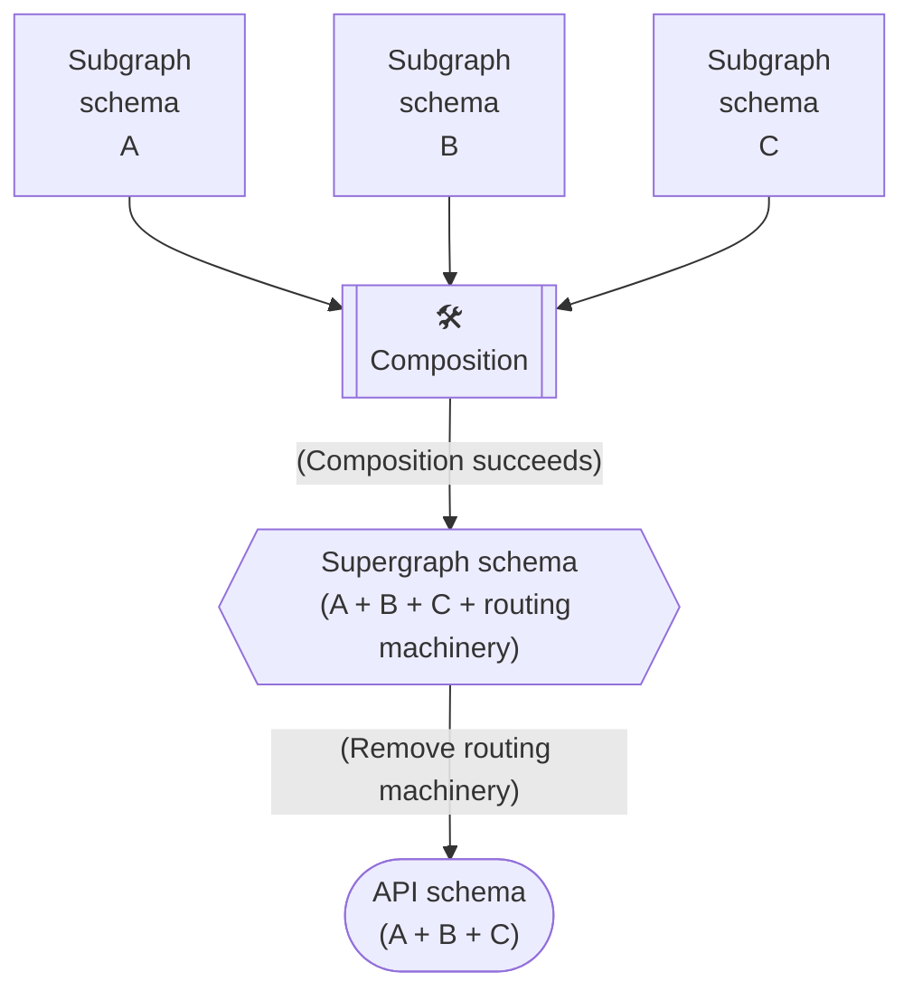

## Start here

### GraphQL’s SDL language is the source of truth.

* https://principledgraphql.com (in style of 12 factor)
* https://www.apollographql.com/blog/announcement/backend/the-supergraph-a-new-way-to-think-about-graphql
* https://www.apollographql.com/blog/announcement/backend/apollo-router-our-graphql-federation-runtime-in-rust

### Neo4j + GraphQL

* Workshop on GraphQL APIs and neo4j: [slides](https://docs.google.com/presentation/d/1fvEwpvkhSAGXRWcVHPQqNOFgvGT9A8yMZXfyF-gn-Bw/edit?usp=sharing), [video](https://www.youtube.com/watch?v=DIFgwgbC-7c)
* [Neo4j and GraphQL The Past, Present and Future](https://www.youtube.com/watch?v=sZ-eBznM71M)

## Apollo Federation (v2)

A federated supergraph uses multiple "types" of GraphQL schemas:

---
(source: https://github.com/apollographql/federation/blob/main/docs/source/federated-types/overview.mdx)

* **Subgraph schemas.** Each **subgraph** has a distinct schema that indicates _which_ types and fields of your composed **supergraph** it can resolve.
    * These are the only schemas that your teams define manually.
* **Supergraph schema.** This schema combines all of the types and fields from your subgraph schemas, _plus_ some federation-specific information that tells your gateway which subgraphs can resolve which fields.
    * This schema is the result of performing [composition](./composition/) on your collection of subgraph schemas.
* **API schema.** This schema is similar to the supergraph schema, but it _omits_ federation-specific types, fields, and directives that are considered "machinery" and are not part of your public API.
    * This is the schema that your gateway exposes to clients, who don't need to know internal implementation details about your graph.

- https://www.apollographql.com/docs/federation/federated-types/overview
- https://www.apollographql.com/docs/federation/federated-types/composition
- https://www.apollographql.com/blog/announcement/backend/announcing-federation-2
- https://www.apollographql.com/docs/federation/
- https://www.apollographql.com/docs/federation/federation-2/new-in-federation-2
- https://github.com/neo4j-graphql/neo4j-graphql-js/blob/dev/docs/apollo-federation.md (note neo4j-graphql-js is no longer a thing, but writeup is good)

### Federation 2 Demo App

https://github.com/apollographql/supergraph-demo-fed2

## Visualizing and documenting

* Investigating: SDL/GraphQL -> OpenApi: https://github.com/IBM/openapi-to-graphql ([ibm docs](https://developer.ibm.com/open/projects/openapi-to-graphql))
* graphql playground w/ neo4j movies db https://movies.neo4j-graphql.com/

## Visualizing Neo4J Model (Closely Tracks GraphQL…generated from it…)

* https://neo4j.com/product/bloom/
* https://cytoscape.org
* https://neo4j.com/developer/graph-visualization
* https://medium.com/neo4j/visualizing-graphs-in-3d-with-webgl-9adaaff6fe43
* https://github.com/neo4j-contrib/neovis.js
* https://github.com/vasturiano/3d-force-graph

## CI/CD tooling

* schema composition checks as well as generating all the things: https://www.apollographql.com/docs/rover, https://github.com/apollographql/rover
* TODO: GitHub has a great tool "GraphQL Doctor" I think?  for automated PR recommendations / linting.

## Subscriptions

Apollo Federation 2 doesn’t support subscriptions OOTB, have been checking this out as well: https://github.com/apollosolutions/federation-subscription-tools

